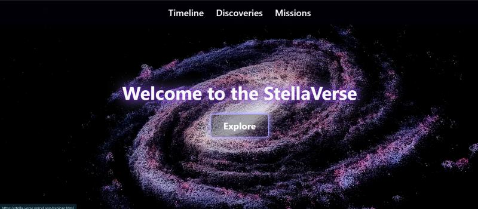
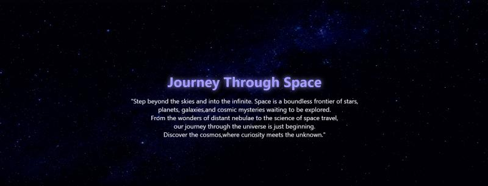
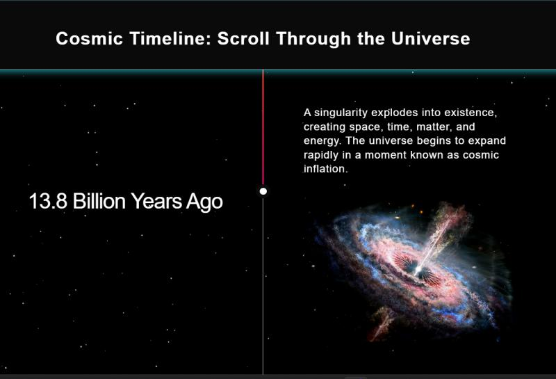
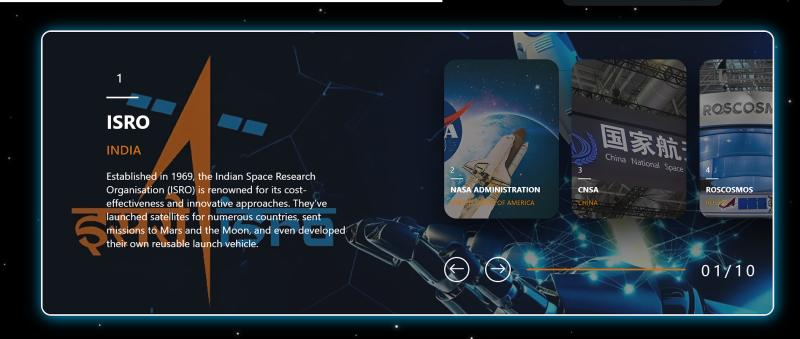
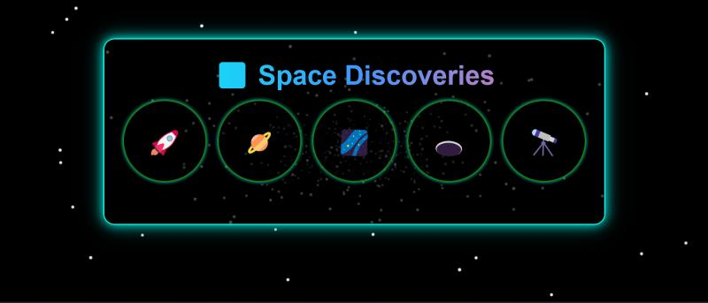
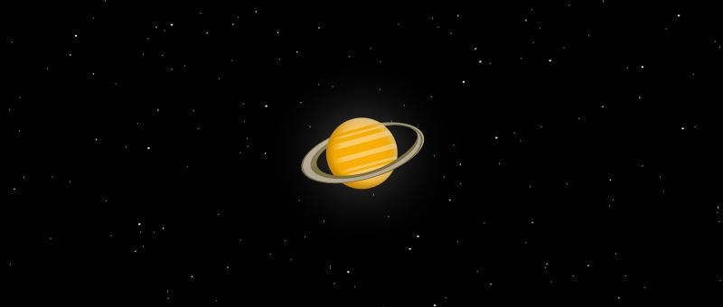
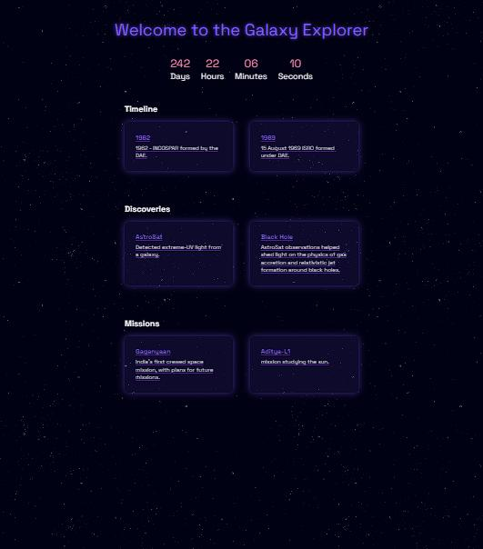

# StellaVerse

🌌 **StellaVerse — A Cosmic Exploration Website**
A captivating fan-made tribute site dedicated to space exploration and cosmic phenomena. This website offers immersive content on space missions, celestial bodies, and astronomical discoveries, all wrapped in a sleek, space-themed aesthetic.

---

## 🎯 Project Objective

To create a visually stunning, responsive, and interactive website that celebrates space exploration, featuring missions, space telescopes, and astronaut profiles with rich media and interactive elements.

---

## 🚀 Live Demo

🔗 [StellaVerse Live Demo](stella-verse.vercel.app)

---

## 🖥️ Tech Stack

* HTML5, CSS3, Vanilla JavaScript (ES6+)
* Responsive Design with Flexbox & Grid
* Smooth animations and scroll transitions
* LocalStorage 

---

## 🌟 Features

### 🏠 Homepage

* Starfield animated background
* Cosmic intro animation with parallax effect
* Navigation menu with glowing hover transitions

### 🕰️ Timeline

* Chronological scroll of major space events
* Interactive dots for quick navigation
* Key missions, launches, and milestones with visuals

### 🔭 Discoveries

* Grid of astronomical breakthroughs
* Hover cards with summaries and images
* Modal popup with deeper insight on each discovery

### 🚀 Missions

* Carousel or card view of iconic missions
* Details on agencies, launch dates, and mission success
* Spacecraft visuals and mission purpose

### ✨ Visuals & Animations

* Neon-glow effects and hover animations
* Star and planet elements that respond to mouse movement
* Fully responsive design for desktop and mobile

---

## 📸 Project Screenshots

**Homepage**  


**Homepage**  


**Timeline**  


**Missions**  


**Discoveries**  


**Loading Icon**  


**Explore**  



## 📁 Folder Structure

```
stellaverse/
├── index.html
├── index.css
├── index.js
├── mission.html
├── mission.css
├── mission.js
├── discovery.html
├── timeline (1).html
├── timeline (1).css
├── timeline (1).js
├── style.css
├── images (astronauts, planets, telescopes, missions, agencies, etc.)
└── README.md
```

✅ Each section has its own modular CSS and JS file for maintainability and reusability.

---

## ⚙️ Setup Instructions

1. **Clone the Repository**

   ```bash
   git clone https://github.com/AANYARAI/StellaVerse.git
   cd stellaverse
   ```

2. **Open Locally**

   * Open `index.html` directly in your browser, or
   * Use Live Server for a better development experience:

     ```bash
     npm install -g live-server
     live-server
     ```

3. **Deploy on GitHub Pages (Optional)**

   * Push your repo to GitHub
   * Go to **Settings > Pages**
   * Set the source branch to **main** and root directory to `/`
   * Your site will be live at:
     👉 [https://Aadya2901.github.io/StellaVerse](https://Aadya2901.github.io/StellaVerse)

---

## 👥 Contributors

| Name                                                | Role                               |
| --------------------------------------------------- | ---------------------------------- |
| [Aadya2901](https://github.com/Aadya2901)           | Timeline Page, Deployment          |
| [iam-anish15](https://github.com/iam-anish15)       | Mission Page                       |
| [ananyamishra13](https://github.com/ananyamishra13) | Discovery Page                     |
| [AANYARAI](https://github.com/AANYARAI)             | HomePage, Page Linking             |

---

## 🤝 Contributing

We welcome contributions and suggestions!
To contribute:

1. Fork the project
2. Create a new branch (`git checkout -b feature/FeatureName`)
3. Commit your changes (`git commit -m 'Add new feature'`)
4. Push to your branch (`git push origin feature/FeatureName`)
5. Open a Pull Request

---

## 📝 License

This project is licensed under the **MIT License**.
Feel free to use it for personal, educational, or collaborative purposes.

---

## 🌠 Final Note

> “Somewhere, something incredible is waiting to be known.” – Carl Sagan

Thank you for exploring **StellaVerse**.
We hope it inspires your inner astronaut 🚀
